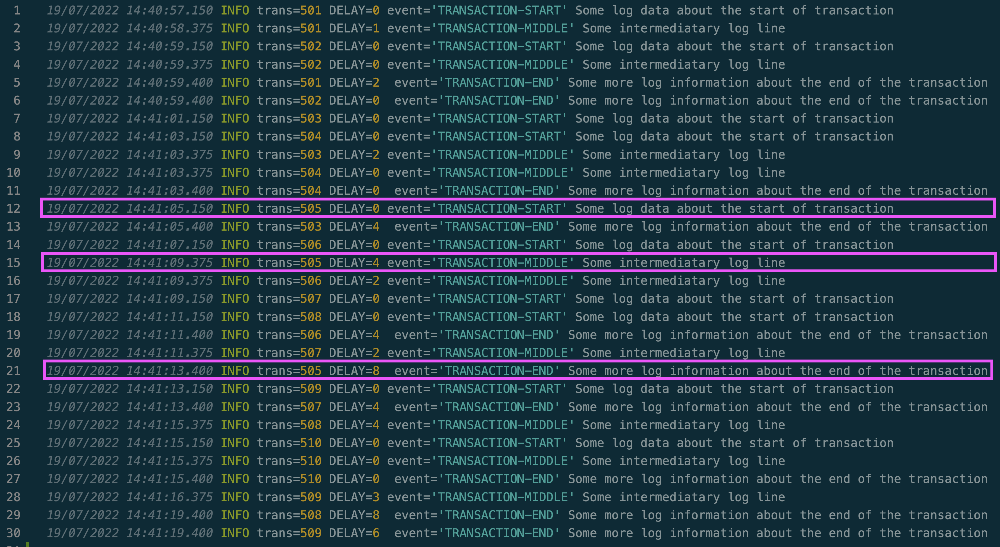
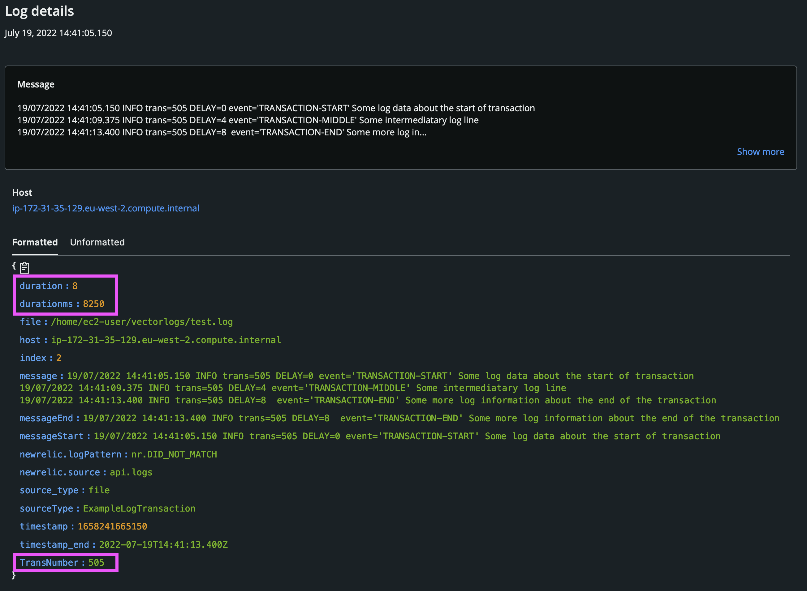

[](https://opensource.newrelic.com/oss-category/#new-relic-experimental)

# Extract transactions from logs using Vector


## Configuration
Example of using [Vector](vector.dev) to extract transactions from log data. Here we demonstrate with a simple toy example how to reduce multiple log reocrds into a single transaction in order to pre-process the transaction duration.

The [vector.toml](vector.toml) file contains the configuration for detecting transactions as is commented. 

## The example use case
In the example use case our transactions can be identitifed by a common transaction number field "trans=xxxx". Our transactions start when the the first entry with a new transaction number appears and ends when a log line with "TRANSACTION-END" and the same transaction number appears. The vector reduce transformation works by specifying the end transaction condition. We extract the duration of the transaction based upon the timestamp of the first log line and the last log line for each transaction.

The example use case also shows how you might parse and extract a timestamp from a log record to be used as the transaction timestamp.

For instance in the following input transaction 505 takes 8 seconds from start to finish. You can see how the three log lines are reduced to one transactional log line:





## Example data
Some example data for both the source and sink output can be found in the [data-generator](./data-generator/) folder. There is also a test script [`multiple.sh`](./data-generator/multiple.sh) that allows you to generate example transactions that interleave.

## Shipping logs via New Relic agent (or fluentbit)
If you are *not* using the New Relic sink and are instead outputting to file and shipping with fluentbit or the New Relic infrastructure agent you will need to re-format the timestamp to a supported unix timestamp.

To do this remap the timestamp field in Vector like this (it must be a unixtimestamp *string*):

```
[transforms.unixtime]
type = "remap"
inputs = ["duration"]
source = '''
.timestamp_original=.timestamp
.timestamp=format_timestamp!(.timestamp,"%s")
'''
```

In fluentbit configuration parsers.conf configure a parser like this:
```
[PARSER]
    Name        timestampParser
    Format      json
    Time_Key    timestamp
    Time_Format %s
    Time_Keep   On
```

You might configure your INPUT in fluetnbit like this:
```
[INPUT]
    Name tail
    path /path/to/log/files/*.log
    Parser timestampParser
```

## Support

New Relic has open-sourced this project. This project is provided AS-IS WITHOUT WARRANTY OR DEDICATED SUPPORT. Issues and contributions should be reported to the project here on GitHub.

>We encourage you to bring your experiences and questions to the [Explorers Hub](https://discuss.newrelic.com) where our community members collaborate on solutions and new ideas.


## Contributing

We encourage your contributions to improve [Project Name]! Keep in mind when you submit your pull request, you'll need to sign the CLA via the click-through using CLA-Assistant. You only have to sign the CLA one time per project. If you have any questions, or to execute our corporate CLA, required if your contribution is on behalf of a company, please drop us an email at opensource@newrelic.com.

**A note about vulnerabilities**

As noted in our [security policy](../../security/policy), New Relic is committed to the privacy and security of our customers and their data. We believe that providing coordinated disclosure by security researchers and engaging with the security community are important means to achieve our security goals.

If you believe you have found a security vulnerability in this project or any of New Relic's products or websites, we welcome and greatly appreciate you reporting it to New Relic through [HackerOne](https://hackerone.com/newrelic).

## License

This project is licensed under the [Apache 2.0](http://apache.org/licenses/LICENSE-2.0.txt) License.


